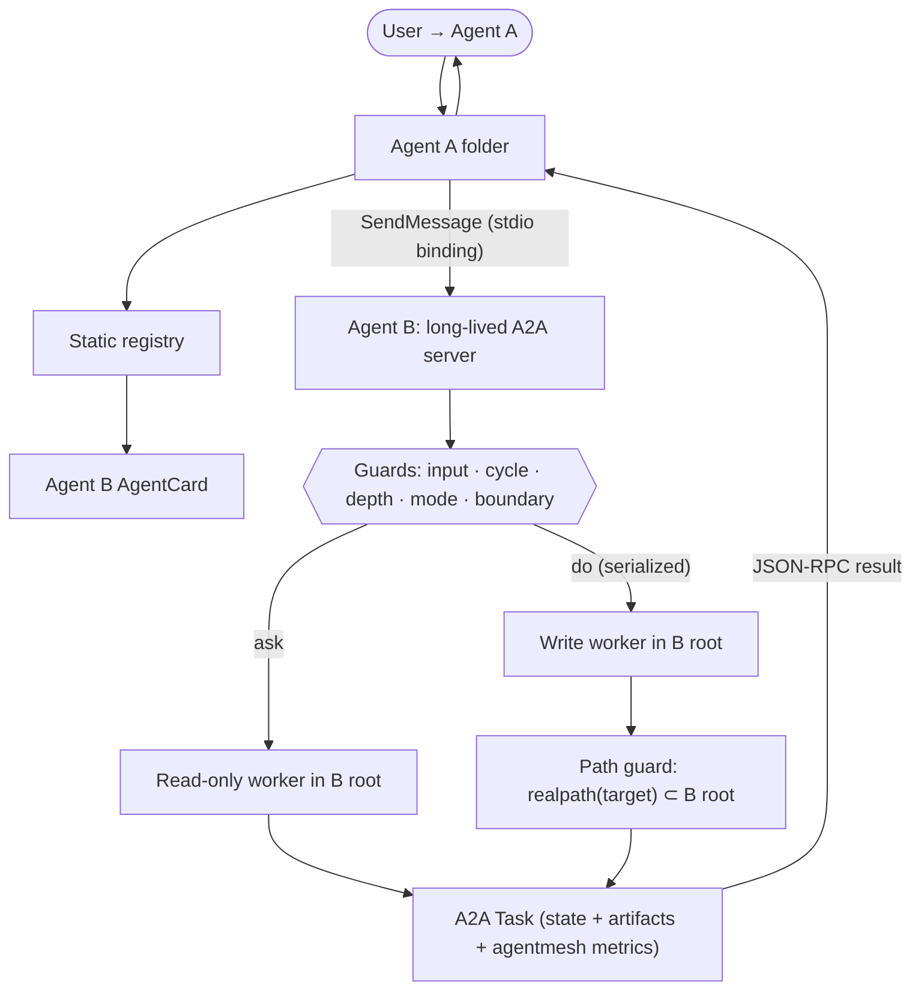

# PROJECT

This repository delivers a **framework**: an industry-A2A-conformant
agent-to-agent delegation contract with isolation, bounded recursion, and
failure-as-data guarantees. Two named pieces support it:

- **`agent-mesh`** — the *reference implementation* of the contract (local
  stdio transport binding).
- **Agents A & B** — the *evaluation harness* that probes, measures, and
  optimizes the framework. They are instruments, not the product.

The document is in three layers, in dependency order:

1. **Framework Contract** — transport-agnostic, the deliverable.
2. **Reference Implementation** — `agent-mesh` over local stdio.
3. **Evaluation Harness** — how A & B exercise and optimize the framework.

---

# Layer 1 — Framework Contract (the deliverable)

## 1.1 Goal

Let any Agent A delegate a scoped task to any Agent B **as a peer agent over
A2A**, such that B can change only its own folder, recursion is bounded, and
every outcome is structured data. The contract is **transport-pluggable**;
local stdio is one binding, HTTP(S) is the conformance/interop binding.

North star: a conformant peer is indistinguishable, at the A2A object level,
from any other A2A agent — same `AgentCard`, `SendMessage`, `Message`/`Task`/
`Part`/`Artifact`, `TaskState`.

## 1.2 A2A Conformance Posture

**Conformant (semantics, all bindings):** real `AgentCard` schema
(`name`, `description`, `version`, `capabilities`,
`defaultInputModes`/`defaultOutputModes`, `skills[{id,name,description,tags}]`,
`securitySchemes`, `supportedInterfaces[{url,protocolBinding,protocolVersion}]`);
method **`SendMessage`** (JSON-RPC 2.0, A2A v1.0) — *not* the legacy v0.3.0
`message/send` (removed; answered with `-32601`); objects `Message`/`Part`
(text|file|data — member-discriminated, no `kind` field)/`Task`/`TaskStatus`
(with ISO-8601 `timestamp`)/`Artifact`; standard `TaskState`
(`TASK_STATE_SUBMITTED|TASK_STATE_WORKING|TASK_STATE_INPUT_REQUIRED|
TASK_STATE_COMPLETED|TASK_STATE_CANCELED|TASK_STATE_FAILED|
TASK_STATE_REJECTED|TASK_STATE_AUTH_REQUIRED`); roles `ROLE_USER`/`ROLE_AGENT`;
`SendMessage` returns the `task` member of the `SendMessageResponse` oneof.

**Non-standard, stated honestly:** the standard A2A transports are
JSON-RPC/gRPC/REST over HTTP(S). The reference impl uses a **local stdio
transport binding** (identical A2A JSON-RPC messages, newline-delimited, over a
child process's stdio). The stdio binding is an agent-mesh **custom protocol binding** (declared as
`protocolBinding: "STDIO"` in `supportedInterfaces`, per the v1.0 §5.8
custom-binding identification rules); because
only transport differs, the HTTP(S) binding is an adapter, not a rewrite.

**Extensions, namespaced:** `ask`/`do` mode and recursion bookkeeping live in
`message.metadata` / `Task.metadata` under `agentmesh/*` and out-of-band env —
never silently mixed into core A2A fields.

## 1.3 Framework Boundary (what the framework owns vs. the integrator)

This line is normative — A & B (and any agent) must stay on their side of it.

| Framework provides | Integrator / agent author provides |
|---|---|
| Transport adapter (stdio v1; HTTP later) speaking A2A JSON-RPC | The agent's `AGENT.md` + `agent.json` (`AgentCard`) |
| Guard pipeline: input validation, cycle, depth, mode, boundary | The actual work executor plugged into the runner SPI |
| Runner SPI + per-folder serialization + timeout/process-tree kill | Caller-side static registry wiring |
| Path-guard enforcement (realpath ⊂ B's root) | — |
| Change detection (`files_changed`), Task/error builder | — |
| Conformance suite + measurable-signals emission | — |

**Public API surface (the only thing A/B or any integrator may import):**

- `createA2AStdioServer({ root, env })` → serves one agent over the stdio
  binding (`.start(input, output)`).
- `createA2AClient(registry, options?)` → `.send(peer, message) → Task`,
  `.initialize(peer)`, `.close()`.
- `delegateTask({ root, env, input })` → the work executor; returns a structured
  result `{ status, summary, files_changed, log_path, ... }` that the server
  maps to a `Task`. v1 wires this in directly; a *pluggable* `Runner` SPI
  (injecting an alternate executor) is a planned refinement, not yet exposed.
  The framework-narrowed MCP surface the worker may use (see §1.6) is computed
  per task from the read-only-marked declarations in the folder's own `.mcp.json`
  and the mesh-global `mesh/mcp.json`; neither the agent nor the mesh author sets
  it freely.
- Schema validators / builders: `AgentCard`, `Message`, `Task`, error taxonomy.

If an instrument needs a non-exported internal to do its job, **that is a
recorded conformance finding** (API too thin), not a workaround.

## 1.4 Task Modes (extension, normative)

Carried as `message.metadata["agentmesh/mode"]`; reflected by the card.

- `ask` — read-only; B inspects its own folder, returns analysis, no writes.
- `do` — write-capable, **only inside B's root**; structured write paths are
  `realpath`-canonicalized; writes outside B's root are denied + logged; B
  never receives A's folder as a writable root.
- **`readonly_parent` rule (restored invariant):** a `do` delegated from a
  parent task that is itself running under `ask` is `rejected`
  (`error_code: readonly_parent`). Read-only must not launder into a write
  one hop down.

## 1.5 Identity & Recursion (anti-spoof, normative)

- **Identity = the `realpath`-canonical absolute folder root.** The *same*
  canonical identity is used both as the cycle-detection key **and** as the
  single writable root. These must never diverge.
- Call context — canonical call path, remaining depth, task id — travels
  **outside the model-visible message** (process env / parent runner state).
  Model-supplied path/depth/bookkeeping fields are ignored.
- A→B then B→A → `rejected` (`cycle`); exhausted depth → `rejected`
  (`depth_budget`).
- **Global mesh layer trust.** The worker's *obeyed* system prompt may include
  skill summaries from a global `mesh/skills/` directory, located by walking
  ancestors of the agent root. That content is therefore trusted-as-instructions.
  On a single-user filesystem the ancestors are the user's own directories. On a
  shared/multi-tenant filesystem, set `AGENT_MESH_MESH_CEILING` (or
  `AGENT_MESH_MESH_ROOT`) to bound which ancestor's `mesh/` can reach the prompt;
  otherwise the walk reaches the filesystem root. `AGENT.md`, by contrast, is
  never obeyed (§1.6) — only `prompts/`, `memory/`, `workflows/`, `skills/`, and
  the resolved global `mesh/skills/` feed the prompt.

## 1.6 MCP Compatibility & Boundary (normative)

**Principle.** MCP is how an agent acquires *its own* capabilities and context
(**agent → tools/resources**). It is **not** the agent-communication layer —
A2A is. Modeling "another agent" as "an MCP tool" is a category error (it loses
Task lifecycle, AgentCard, and peer identity); that misuse is exactly what this
redesign removes. When Agent B uses MCP while executing a delegated task, it is
B *implementing its own work* — so those effects are confined exactly like any
other action B takes.

**Path-guard gap (why this section exists).** The path-guard PreToolUse hook
matches only structured write tools (`Edit|Write|MultiEdit|NotebookEdit`). An
MCP tool's side effects (filesystem, network) are **not** reliably gateable by
inspecting a structured path argument — same un-gateable property that excludes
`Bash` from `do`. So MCP write/effect tools are *excluded, not pretended safe*.

**Protected-config writes (Boundary 5, enforced).** Beyond the out-of-root deny,
the `do`-mode path-guard hook also denies writes to the agent's own *trusted
configuration* — `prompts/`, `agent.json`, `.mcp.json`, `registry.json`,
`tools/`, `memory/`, `workflows/`, `skills/` — even though they sit inside the
writable root. Those paths feed the worker's obeyed identity/grants/wiring, so a
normal delegated task may not rewrite them (self-modifying config is a separate
admin workflow). Runtime/state, logs, data, and task-owned work paths stay
writable; `AGENT.md` is public data (never obeyed) and is not protected.

**`mcpSurface` rules (framework-enforced; the agent author cannot widen them):**

- `ask`: only servers the author has **explicitly marked read-only** via
  `"x-agentmesh": { "readOnly": true }` — in the folder's own `.mcp.json` **or in
  the mesh-global `mesh/mcp.json`** (the shared tool registry, now grantable under
  the same rule, not merely discovery). An unmarked (or `readOnly:false`)
  declaration is **not** granted, so the default surface is **none**.
  `declaration ≠ grant` holds identically for agent-local and mesh-global servers;
  a single assembler (`assembleMcpServers`) computes the set so the rule lives in
  one place. A reserved-name filter drops any `agentmesh_*` server from **either**
  source (it is the framework peer-bridge namespace). The framework strips its
  `x-agentmesh` marker before handing the config to the worker, and
  `--strict-mcp-config` ensures only these mesh-defined declarations are eligible
  (no caller/user-global MCP leakage). The marker is a coarse opt-in; finer
  per-tool capability flags are a planned refinement.
- `do`: **all non-framework MCP tools disabled by default** (the grant returns
  the empty set regardless of markers). Broadening (a writing/effecting MCP tool
  inside `do`) requires Phase 2 + OS sandbox — same gate as re-enabling `Bash`.
- Nested delegation (B→C) is **A2A, not MCP**. The legacy MCP-as-transport
  (the validated reference's `delegate_task` MCP tool) is removed from the
  model. Any MCP peer config the runner still passes is `strict-mcp-config`
  filtered (see §2.4) and is **compat-only**, never the delegation path.

**A2A↔MCP interop (compat-only).** An A2A peer MAY *optionally* also expose an
MCP `delegate_task` shim so MCP-only callers can still reach it. This is a
clearly-marked compatibility surface, not the model, and does not change that
A2A is the agent-communication layer. Default: off.

**Worker onward delegation — the framework peer bridge (normative carve-out).**
A headless `claude -p` worker can only act through tools, so for a *worker* to
initiate onward delegation it must be handed a tool. To keep "agent-as-MCP-tool
is a category error" intact, the framework grants the worker **one** owned MCP
server — the **peer bridge** — exposing generic verbs (`list_peers`,
`delegate_to_peer({ peer, mode, task, new_conversation? })`). The peer is named
as **data** (an argument), never registered as a per-peer tool, and
`delegate_to_peer` performs a real A2A `SendMessage` over `createA2AClient`: the
worker→bridge hop is local MCP, the **bridge→peer hop is A2A**, so the
delegation path is still A2A. The bridge is framework-owned (not an agent
`.mcp.json` declaration), is injected only when the agent's marker-validated
`registry.json` has peers, and is **ask-only in v1** (it refuses any non-`ask`
onward call). `do` onward delegation is deferred until there is a cross-process
per-canonical-root write lock and downstream-Task audit propagation (see the
onward-delegation design spec). This is the single sanctioned worker-visible MCP
delegation surface; nothing else may model a peer as a tool.

**Peer discovery (two tiers, untrusted data).** `list_peers` returns each peer's
bounded `AGENT.md` self-description (`{ name, description, capabilities? }`),
and the worker's runtime prompt carries a one-line-per-peer roster (capped at
160 chars/line, max 10 peers, placed last in the prompt budget) so a worker can
route a task *before* attempting it. Both surfaces are the peer's self-reported
claim — bounded, framed as data, never instructions (the `AGENT.md` invariant).
The roster names the bridge's MCP server (`agentmesh_peerbridge`) because
workers see namespaced tool names and a bare verb name is not discoverable.

**Multi-turn peer sessions (caller-keyed, persistent).** Repeated
`delegate_to_peer` calls from agent B to peer C continue **one** persistent
`claude` session on C, keyed `from:<caller>`: the bridge stamps the caller's
mesh-unique manifest name as `message.metadata["agentmesh/caller"]`
(framework-resolved from the caller's real root — never a model argument, so a
worker cannot impersonate another agent's thread), and C derives a
deterministic session id (`uuidv5(caller:epoch, ns=encoded-root)`), choosing
`--resume` vs `--session-id` purely from the on-disk transcript — no in-memory
state, durable across per-call teardown and restarts. `new_conversation: true`
(the one added model-facing arg; it cannot name another caller) is carried as
`agentmesh/reset_conversation` and makes C bump + persist that caller's epoch —
a durable thread reset. Threads rely on Claude Code auto-compaction and are
best-effort context, not guaranteed recall; the response stamps the thread's
turn count (see §1.9) as the caller's signal to reset. Spec:
`docs/superpowers/specs/2026-06-09-multi-turn-peer-sessions-design.md`.

## 1.7 Result & Failure Semantics (single authoritative channel)

`SendMessage` **always returns an A2A `Task`** (wrapped as the
`task` member of the `SendMessageResponse` oneof) — this is the only channel a
caller's fallback logic reads:

- `status.state`: `TASK_STATE_COMPLETED` (done) · `TASK_STATE_FAILED` (timeout /
  spawn / internal — reason in `status.message`, partial work still in
  `artifacts`) · `TASK_STATE_REJECTED` (cycle / depth_budget / readonly_parent).
- Agent-mesh specifics in `Task.metadata`, namespaced: `agentmesh/files_changed`
  (string[]|null), `agentmesh/log_path`, `agentmesh/run_id`,
  `agentmesh/preexisting_dirty?`, `agentmesh/error_code` (closed set:
  `bad_input`, `cycle`, `depth_budget`, `readonly_parent`, `boundary_denied`,
  `mode_disabled`, `spawn_failed`, `internal`, `caller_identity_unresolved`).
- Request-side `message.metadata` carries framework-set routing/correlation
  fields, never model-authored: `agentmesh/mode` (§1.5), `agentmesh/parent_run_id`
  (board edge correlation), and for onward delegation `agentmesh/caller` +
  `agentmesh/reset_conversation` (multi-turn peer sessions, §1.6).
- **Write-boundary enforcement is *not* a returned `error_code`.** An out-of-root
  write is denied inside the worker by the PreToolUse path-guard hook (`exit(2)`,
  appended to `path-guard-denials.jsonl`, counted in the `isolation_violations`
  signal); the worker then finishes normally, so the task returns
  `completed`/`failed` with the offending write simply absent from
  `files_changed`. A `boundary_denied` code (promoting a hook denial to a
  `rejected` Task) is **reserved/planned**, not emitted in v1 — callers detect
  confinement via `isolation_violations` / the denial log, not `error_code`.
- **JSON-RPC `error` is reserved strictly for protocol/transport failures where
  no Task can be formed**: malformed JSON (`-32700`), invalid JSON-RPC envelope
  (`-32600`), unknown method (`-32601`), internal (`-32603`). A *valid* request
  that fails for an agent-mesh reason is never a JSON-RPC error — it is a `Task`
  with `rejected`/`failed`. In particular, **shape-invalid `SendMessage` params**
  (missing message, bad/absent mode, empty/oversize task) are returned as a
  `bad_input` *Task*, not `-32602` (the legacy MCP server still uses `-32602` for
  unknown tools). This is the pinned resolution of the prior ambiguity:
  **outcomes are data (Task); only un-parseable requests are errors.**

## 1.8 Concurrency

Each agent folder serializes delegated `do` tasks — at most one write-capable
task per folder at a time — keeping change-detection and boundary enforcement
deterministic. `ask` may run concurrently (read-only).

## 1.9 Measurable Signals (so the framework can be evaluated/optimized)

Every task emits, in `Task.metadata["agentmesh/metrics"]` and the run log:

- timing breakdown: `queue_wait_ms`, `worker_spawn_ms`, `worker_run_ms`,
  `change_detect_ms`, `total_ms`;
- `isolation_violations` (path-guard denials this task) — **must be 0** on any
  conformant happy path;
- `recursion_refusals` by `error_code`;
- `turn` (multi-turn ask responses only, omitted otherwise): the persistent
  thread's conversation depth — `user_text` events in the resumed transcript,
  not raw lines. There is no live context-fill signal in headless `claude -p`;
  this is the caller's proxy for "thread is getting long, consider
  `new_conversation`";
- `headroom` (multi-turn ask responses only, omitted otherwise): approximate
  thread headroom percent (0–100) computed from the last assistant usage in the
  transcript tail against `AGENT_MESH_CONTEXT_WINDOW`; best-effort — present
  only when measurable, omitted otherwise (additive minor field per §1.10);
- `conformance`: pass/fail when run under the conformance suite;
- `tokens`/`cost_usd` when the runner is a real model.

Optimization loop = run the evaluation matrix → read these signals → change the
framework → re-run; "better" is defined only against these numbers + the
conformance pass rate, never against the demo's prose.

## 1.10 Versioning & Compatibility

- Framework carries `frameworkVersion` (SemVer); surfaced in metrics.
- **Stable surface (breaking change ⇒ major):** the A2A wire contract
  (AgentCard subset, `SendMessage`, `Task` shape), the `agentmesh/*` metadata
  namespace, the closed `error_code` set, the §1.3 public API.
- **Evolving (minor/patch):** transport bindings, runner internals, signal
  additions, the reference implementation.

## 1.11 Non-Goals

No HTTP server in v1 (stdio binding only); no federated/untrusted-peer profile
in v1 (trusted same-owner workspaces first); no automatic FS discovery; no
central broker; no parallel fan-out; no post-timeout rollback; no kernel-sandbox
claim (folder safety = cwd + limited tool surface + realpath checks +
path-guard).

---

# Layer 2 — Reference Implementation (`agent-mesh`, local stdio)

## 2.1 Status & Migration

A prior **MCP-based** implementation of this exact delegation model exists and
is **end-to-end validated**: 20/20 deterministic tests green + a real-`claude`
A→B live proof that found and fixed 3 real bugs (MCP stdio framing, headless
`do` write-permission, change-detect delta). That code (`src/mcp.js`,
`delegate.js`, `context.js`, `change-detect.js`, `hooks/path-guard.js`, the
suites, `examples/agent-{a,b}`) is the **proven behavioral reference**: the A2A
layer re-expresses the same guarantees; the deterministic suites are the
migration safety net. MCP is **retained as the orthogonal agent→tools/context
layer — not demoted, not an "A2A bridge."** `CLAUDE.md` documents the current
MCP code and is updated as the A2A layer lands.

## 2.2 Transport Binding Lifecycle (pinned)

- The `serve-a2a` server is **long-lived per peer, per caller session**
  (started from the caller's static registry, reused across many
  `SendMessage`). It implements `initialize`, `SendMessage`, `ping`; closes
  on stdin EOF.
- Each `SendMessage` runs an **isolated per-task worker** (reference runner
  spawns `claude -p`, `cwd=B-root`, `detached`, structured-write tools only +
  path-guard hook for `do`). The server owns: handshake, per-folder `do`
  serialization, timeout → process-tree kill → still return a `Task`
  (`failed`, partial artifacts).

## 2.3 Folder Agents & Registry

- `AGENT.md` — untrusted descriptive data; length-bounded before exposure;
  never executed or treated as instruction.
- `agent.json` — standard A2A `AgentCard`; `supportedInterfaces:[{url:"stdio:...",protocolBinding:"STDIO"}]` + an
  `x-agentmesh` block (modes, spawn command) are the documented local-binding
  extension; every other field is standard so the HTTP(S) adapter only adds a
  `supportedInterfaces` entry.
- Caller discovers peers via a static local `registry.json` (peer name → owned
  root → spawn → card). No broker in v1.

## 2.4 Reference Modules (← derived from validated code)

| Module | Responsibility | From |
|---|---|---|
| `src/a2a/protocol.js` | A2A object validation, `TaskState` map, errors, artifacts | `contract.js`,`errors.js` |
| `src/a2a/stdio-server.js` | NDJSON A2A JSON-RPC server (`initialize`/`SendMessage`/`ping`) | `mcp.js` (framing fix) |
| `src/a2a/stdio-client.js` | Registry lookup, spawn peer, send `SendMessage`, await `Task` | new |
| `src/a2a/registry.js` | Static wiring → canonical peer roots | new |
| `src/delegate.js` | `ask`/`do` work executor: guard pipeline, spawn, MCP grant, logging | `delegate.js`,`context.js`,`change-detect.js` |
| `src/process.js` | spawn, timeout, process-tree kill (SIGTERM→SIGKILL escalation) | `delegate.js` |
| `hooks/path-guard.js` | Deny writes whose realpath is outside B's root | unchanged |

**MCP-scoping invariant (normative).** The runner spawns the worker with
`--strict-mcp-config --mcp-config <generated>`, where the generated config is a
per-task **grant** computed by the unified `assembleMcpServers` (in
`src/mesh-mcp.js`, used by both the worker and the native CLI entry point).
`--strict-mcp-config` guarantees the worker never inherits the caller's or the
*user-global* MCP config — only **mesh-defined** declarations are eligible: the
folder's own `.mcp.json` **and** the mesh-global `mesh/mcp.json`. The grant then
narrows that set per §1.6: in `ask`, only servers carrying `"x-agentmesh": {
"readOnly": true }` (marker stripped before emission); in `do`, the empty set;
`agentmesh_*` reserved-namespace servers are dropped from either source. A
declaration is necessary but **not sufficient** — neither the agent author nor the
mesh author can widen the surface beyond read-only, and the default surface is
empty. (The native CLI entry point is the one gated, opt-in exception that runs a
*full* native session — see its design spec.)

## 2.5 Architecture

---

# Layer 3 — Evaluation Harness (Agents A & B)

## 3.1 Principle

A & B are **minimal and framework-pure**: near-zero logic of their own, so any
observed behavior is a property of the framework, not of clever agents. They
import **only the §1.3 public API**. They are parameterizable to reach every
framework surface and failure mode — not a happy-path demo.

## 3.2 Agent B — scriptable probe (the target)

Behavior is fully driven by the incoming task/metadata directive, so the
harness can force every code path:

- happy: `ask` → analysis; `do` → one confined write.
- adversarial (harness-triggered): write outside B root (→ path-guard deny);
  call back to A (→ `cycle`); sleep past timeout (→ `failed` + partial);
  emit malformed line (→ protocol robustness); `do` under an `ask` parent
  (→ `readonly_parent`); oversize output (→ bounding); claim a `files_changed`
  that didn't happen (→ change-detect honesty).
- **Two B variants:** a deterministic scripted B (no LLM — powers the
  conformance suite) and an opt-in real-`claude` B (`AGENT_MESH_E2E=1` — the
  live proof). This deterministic-core + opt-in-real split *is* the validated
  evaluation methodology.

## 3.3 Agent A — scripted driver

Per harness scenario, performs one delegation and asserts the framework
contract on the returned `Task`: `state` mapping, `agentmesh/*` namespacing,
`files_changed` correctness, isolation (**A's folder untouched**), recursion
refusal codes, metrics present.

## 3.4 Evaluation Matrix = the conformance suite

Cells: `(mode: ask|do) × (outcome: happy | timeout | cycle | depth |
boundary-violation | bad-input | oversize | readonly_parent) ×
(mcpSurface: none | read-only-allowed | effect-attempted)` → expected
`Task`/error. This matrix **is** the transport-agnostic conformance suite; the
§3.5 knowledge demo and the slugify story are only its human-readable *happy*
cells on different axes.

Suites:

- **Protocol** — NDJSON framing (no LSP `Content-Length`); `initialize`/`ping`/
  `SendMessage`; malformed → JSON-RPC error; bad input → `Task rejected`
  (`bad_input`).
- **Boundary** — B writes its own file; B cannot write A's; symlink &
  missing-parent escapes denied. (Deterministic — the security proof.)
- **Recursion** — A→B→A `cycle`; depth 0 `depth_budget`; `readonly_parent`;
  spoofed model-visible path/depth ignored.
- **Delegation E2E** — spawn B; `ask` then `do`; `state:"completed"`;
  `files_changed` ⊆ B paths; A consumes result; A folder unmodified. Real-
  `claude` variant opt-in.
- **MCP boundary (§1.6)** — `ask` + a read-only-marked `book-search` in
  `mcpSurface` → `completed`; an **unmarked** declaration NOT granted → empty
  surface (default-deny proven, see `delegate.test.js`); `do` grants no MCP
  tools regardless of marker; A never receives B's MCP config (strict-mcp
  filter, §2.4). (Per-task `mcp_tools_used` metadata is a planned signal, not
  yet emitted.)
- **Signals** — metrics present & sane; `isolation_violations==0` on happy
  cells.

## 3.5 Demo — library agent over MCP (the §1.6 human-readable cell)

This demo is deliberately the canonical §1.6 exercise: **B answers using its own
read-only MCP tool; A↔B is A2A; A never sees B's MCP.**

**Agent B — library agent (target).** `examples/agent-b/` ships a tiny
read-only stdio MCP server `tools/book-search/server.mjs` exposing one tool
`search_books({ query }) → [{ title, author, shelf }]` over the agent's own
catalog `books.json`. It owns **no** write capability — it only reads its
catalog. B's identity comes from its own `prompts/system.md` + `prompts/ask.md`
(injected as `--append-system-prompt`); `AGENT.md` (untrusted data) describes it
as the library agent. `.mcp.json` declares `book-search` and marks it
`"x-agentmesh": { "readOnly": true }`, opting it into the `ask` surface.

- `ask`: parse the question → call `search_books` → return the matches as an A2A
  `Task` artifact, `state:completed`. This is the shipped, opt-in real-`claude`
  cell (`test/agent-b-e2e.test.js`, `AGENT_MESH_E2E=1`).
- A `do` variant (fetch then write a summary into B's own folder, exercising
  read-only MCP **and** the path-guard together) is a natural extension and is
  **planned**, not yet shipped.

**Agent A — presenter (driver).** `examples/agent-a/` is the caller; it has
**no** book-search MCP and does not own the catalog. A registry wires peer
`library → ../agent-b`. User asks A a question needing the catalog → A
`SendMessage`(`ask`) to B → A receives only the A2A `Task` → A formats the
artifact for the user.

**`mcpSurface` is the pinned dependency:** the framework grants B the read-only
`book-search` tool only because the declaration is marked read-only (§1.6); an
unmarked declaration yields an empty surface (default-deny) — both are §3.4
cells, this section is the *granted-happy* one shown for humans.

The earlier slugify/`truncateSlug` flow (`lib/strings.js`) remains a separate,
simpler `do` happy cell on the non-MCP axis (the validated real-`claude` E2E).

## Future Work

- HTTP(S) JSON-RPC binding — the standard interop path & conformance milestone.
- Richer A2A lifecycle: `message/stream` (SSE), `tasks/get`, `tasks/cancel`,
  push notifications.
- Federated/untrusted profile: `securitySchemes`, OS sandbox before any shell.
- Keep MCP as the agent→tools/context layer.

## Changelog

- 2026-06-13 — managed-wiring auto-sync: the dashboard auto-runs doctor in a new Managed-only mode (registry.json + peer-bridge .mcp.json only) on startup and on a debounced watcher change, keeping wiring current after code updates / new agents; atomic config writes (temp+rename); Seeded/Authored stay propose-only; the framework applies, never an agent (mesh-manager stays propose-only). Opt out: AGENT_MESH_NO_AUTOSYNC=1. Spec: docs/superpowers/specs/2026-06-13-managed-wiring-autosync-design.md.
- 2026-06-13 — review-first session management: copy resume-commands replace dashboard terminal spawning (EDR-proof by construction; /open-terminal deprecated in place), provenance-complete spawn tagging (worker:<route> create events at the delegateTask chokepoint — both modes), deterministic auto-follow of the user's live CLI session (pin/badge, sticky), per-agent transcript-storage transparency, stitched cross-session canvas timeline (seal-on-switch, seams, lazy history). Spec: docs/superpowers/specs/2026-06-13-review-first-session-management-design.md.
- 2026-06-12 — session generations (v0.4 track): headroom measurement (live stream-json usage + bounded transcript-tail scan), agentmesh/metrics.headroom on multi-turn peer responses, out-of-band digest pipeline (ask-only worker, fail-closed contract, framework-applied capped writes to memory/ + propose-only deliverables), headroom-armed self-session rotation under the runner lease with rotate provenance, decisions-index 30-line cap. Spec: docs/superpowers/specs/2026-06-12-session-generations-design.md.
- 2026-06-07 - **A2A v1.0 migration (framework v0.2.0)**: wire contract moved
  from A2A v0.3.0 to v1.0 — `message/send` renamed `SendMessage` (legacy name
  now `-32601`, no alias); `TaskState` re-cased to `TASK_STATE_*` (ProtoJSON)
  and `Role` to `ROLE_USER`/`ROLE_AGENT`; `kind` discriminators removed
  (member-based `Part`s); JSON-RPC result wraps the Task as the `task` member
  of the `SendMessageResponse` oneof; `TaskStatus` gains ISO-8601 `timestamp`;
  AgentCard drops top-level `protocolVersion`/`url`/`preferredTransport` for
  ordered `supportedInterfaces[{url,protocolBinding,protocolVersion}]` (stdio
  declared as custom binding `STDIO` per v1.0 §5.8) plus the four-flag
  `capabilities` object. MCP surfaces (compat server, peer-bridge tool surface,
  tool servers) and the `agentmesh/*` extension namespace are unchanged.
  Deterministic suite green: 500 pass / 6 opt-in skips.
- 2026-06-01 - Code-review reconciliation + hardening. Replaced the wholesale
  `ask`-mode MCP grant with an explicit read-only opt-in marker
  (`x-agentmesh.readOnly`), default none, marker stripped before emission
  (§1.6/§2.4). Reconciled the §1.3 public API (`createA2AStdioServer`,
  `delegateTask` result shape; `Runner` SPI noted as planned) and the §2.4
  module table / MCP-scoping invariant to the actual code
  (`grantToolServers`/`readReadOnlyToolServers`, no `a2a/runner.js`). Retargeted
  the §3.5 demo to the shipped **library agent** (`book-search`/`search_books`
  over `books.json`); the docstore/`get_document`/`cache` variant in the
  2026-05-18 entries below is **superseded** (planned, not shipped). Fixes:
  `NotebookEdit` path arg (`notebook_path`), `-z` rename porcelain parse, server
  UTF-8 chunk reassembly, client per-request timeout + stderr drain + protected
  `peer.env`, `message/send`-notification guard, sub-ms metrics, SIGTERM→SIGKILL
  escalation, book-search notification/null-element guards.
- 2026-05-17 - Initial MCP-based per-folder delegation; real demo proved A→B
  end-to-end, found+fixed 3 real bugs, 20/20 deterministic suite green.
- 2026-05-18 - Reframed around local-first A2A delegation over stdio.
- 2026-05-18 - Standards review: aligned to real A2A (`message/send`,
  `AgentCard`/`Message`/`Task`/`Part`/`Artifact`, `TaskState`); added
  Conformance Posture + Status & Migration; collapsed contradictory result
  contracts into one canonical `Task`.
- 2026-05-18 - **Three-layer restructure** (framework is the deliverable, A/B
  are instruments): split into Framework Contract / Reference Implementation /
  Evaluation Harness; drew the normative framework boundary + public API
  surface; restored dropped invariants (`readonly_parent`, identity == cycle
  key == single writable root); pinned failure semantics (outcomes are a
  `Task`; JSON-RPC error only for un-parseable requests); pinned transport
  lifecycle (long-lived server, isolated per-task worker); added measurable
  signals + versioning/compat policy; recast A/B as the parameterized
  evaluation matrix/conformance suite with the deterministic + opt-in-real
  methodology.
- 2026-05-18 - Added §1.6 **MCP Compatibility & Boundary** (normative): pinned
  the principle that MCP is the agent→tools/context layer and NOT the
  agent-communication layer (A2A is) — modeling an agent as an MCP tool is a
  category error this redesign removes; flagged the path-guard gap (the
  structured-write hook does not cover MCP-tool effects, same un-gateable
  property as `Bash`); set framework-enforced `mcpSurface` rules (`ask` =
  read-only allowlist/default none; `do` = non-framework MCP disabled by
  default; nested delegation is A2A not MCP; optional compat-only MCP shim);
  added `mcpSurface` to the §1.3 Runner SPI; restored the validated
  `--strict-mcp-config` + agent-mesh-peer-filter MCP-scoping invariant in §2.4;
  renumbered §1.7–§1.11.
- 2026-05-18 - Detailed the §3.5 demo as the **knowledge agent over MCP**
  (canonical §1.6 cell): B serves a KB only through an in-process read-only
  `docstore` MCP tool (no `Read`-able copy → MCP is the only path); `ask`
  fetch→display and `do` fetch→cache-into-B variants; A is pure presenter and
  never sees B's MCP. Added the `mcpSurface: none|read-only-allowed|
  effect-attempted` axis to the §3.4 matrix + an MCP-boundary suite (default-
  deny, effect-MCP denied, MCP-content-as-untrusted-data, no docstore leak to
  A). slugify remains a simpler non-MCP-axis happy cell.
